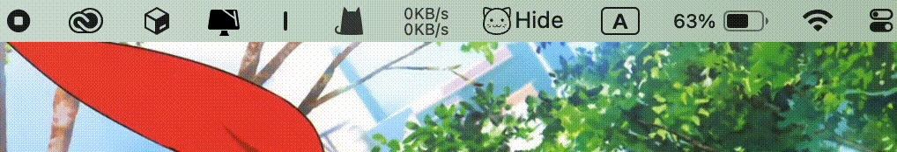

# Kaguya -- A tiny macOS menu bar icon hider

## Usage

1. Move the **Separator** icon to the right side of those icons you want to hide.
2. Click the **Hide/Show** Icon to hide or show those icons.

**!! Hold command (`⌘`) then drag to move the menu bar icons. !!**

## Install

[Download Link](https://github.com/B1ACK917/Kaguya/releases)

Find the latest release, download the zip, uncompress it, and drag the Kaguya.app to your Applications folder.

## Exit

Right click the **Hide/Show Icon** and select **Quit**
