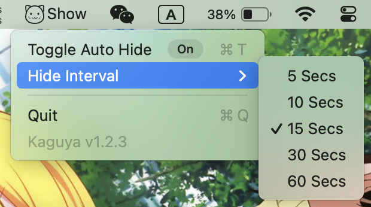

# Kaguya -- A tiny macOS menu bar icon hider

## Usage

1. Move the **Separator** icon to the right side of those icons you want to hide.
2. Click the **Hide/Show** icon to hide or show those icons.

**!! Hold command (`⌘`) then drag to move the menu bar icons. !!**

## Auto hide

Right click on the **Hide/Show** icon, you will see the menu like this:

Here you can change hide interval and switch the auto-hide to on/off.

## Install

[Download Link](https://github.com/B1ACK917/Kaguya/releases)

Find the latest release, download the dmg, drag the Kaguya.app to your Applications folder.

## Open

Check [open-a-mac-app-from-an-unidentified-developer](https://support.apple.com/guide/mac-help/open-a-mac-app-from-an-unidentified-developer-mh40616/mac) if you cannot open the app.

## Exit

Right click the **Hide/Show Icon** and select **Quit**

## Uninstall

Open Applications folder, delete Kaguya.app.

